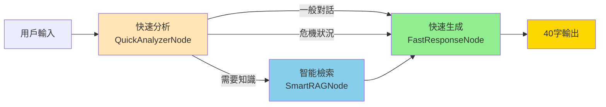

# 雄i聊 Fast Chat 系統重構設計文件

## 📌 核心目標與原則

### 系統定位
- **角色**：高雄市毒防局的關懷聊天機器人「雄i聊」
- **身份**：剛認識不久的朋友（非專業輔導員）
- **對象**：可能有毒品/服刑背景的人（不標籤化）

### 🎯 核心原則（智能彈性版本）

| 原則 | 要求 | 實作方式 |
|------|------|----------|
| **字數限制** | 智能分級（30-100字） | ResponseLengthManager |
| **句子限制** | 視內容調整2-5句 | 根據資訊量決定 |
| **問題限制** | 最多1個問題 | 提示詞明確規定 |
| **語氣要求** | 自然口語、像朋友 | 極簡提示詞 |
| **回應速度** | <1秒 | 2-3步驟流程 |
| **不說教** | 避免專業術語 | 移除額外指引 |
| **資訊完整** | 優先完整性 | 智能截斷保留關鍵資訊 |

#### 📊 分級字數限制表

| 內容類型 | 字數限制 | 使用場景 |
|---------|---------|---------|
| 問候 | 30字 | 簡單打招呼 |
| 一般對話 | 40字 | 日常聊天 |
| 情緒支持 | 45字 | 安慰鼓勵 |
| 危機回應 | 50字 | 緊急資源 |
| 聯絡資訊 | 60字 | 電話地址 |
| 服務說明 | 80字 | 簡單介紹 |
| 機構介紹 | 100字 | 完整說明 |

## 🏗️ 系統架構



## 📦 核心組件設計

### 1. QuickAnalyzerNode（快速綜合分析）

**功能整合**：
- ✅ 危機判斷（DrugSafetyCheckNode）
- ✅ 意圖分析（IntentRouterNode）
- ✅ 語意理解（SemanticAnalyzerNode）
- ✅ 對話理解（ContextUnderstandingNode）

```python
class QuickAnalyzerNode:
    """整合4個分析節點為1個"""
    
    # 關鍵詞快速判斷（避免LLM調用）
    CRISIS_KEYWORDS = ["自殺", "想死", "毒品", "安非他命"]
    INFO_KEYWORDS = ["地址", "電話", "怎麼去", "幾點", "在哪"]
    
    ANALYSIS_PROMPT = """快速分析用戶輸入，返回JSON：
{
  "risk_level": "none/low/high",     // 危機等級
  "need_knowledge": true/false,       // 是否需要查詢知識庫
  "intent": "問候/詢問資訊/情緒支持/求助",  // 意圖類型
  "entities": ["實體1"],              // 關鍵實體（機構名等）
  "search_query": "建議查詢詞"        // RAG檢索關鍵詞
}

用戶：{input_text}
"""

    async def __call__(self, state):
        text = state["input_text"]
        
        # 步驟1: 關鍵詞快速判斷
        if any(w in text for w in self.CRISIS_KEYWORDS):
            state["risk_level"] = "high"
            state["need_knowledge"] = True
            return state
            
        if any(w in text for w in self.INFO_KEYWORDS):
            state["need_knowledge"] = True
            
        # 步驟2: 複雜情況才用LLM
        if len(text) > 20 or "?" in text:
            result = await self._llm_analyze(text)
            state.update(result)
            
        return state
```

### 2. SmartRAGNode（智能知識檢索）

**優化重點**：
- 條件式執行（只在需要時）
- 結果精簡（只保留關鍵資訊）
- 快取機制（避免重複檢索）

```python
class SmartRAGNode:
    """優化的RAG檢索"""
    
    async def __call__(self, state):
        if not state.get("need_knowledge"):
            return state
            
        # 使用建議查詢詞
        query = state.get("search_query", state["input_text"])
        
        # 檢查快取
        if cached := self.cache.get(query):
            state["knowledge"] = cached
            return state
        
        # 精簡檢索
        results = await self.retriever.retrieve(
            query=query,
            k=2,  # 只取2筆
            similarity_threshold=0.5
        )
        
        if results:
            # 提取關鍵資訊（電話、地址）
            key_info = self._extract_key_info(results)
            state["knowledge"] = key_info[:40]  # 確保不超過40字
            self.cache[query] = key_info
            
        return state
    
    def _extract_key_info(self, results):
        """只提取電話、地址等關鍵資訊"""
        info = []
        for r in results[:2]:
            # 正則提取電話
            if phone := re.search(r'07-\d{7,8}|\d{4}', r.content):
                info.append(phone.group())
            # 提取簡短地址
            if "路" in r.content or "號" in r.content:
                addr = r.content.split("號")[0] + "號"
                if len(addr) < 20:
                    info.append(addr)
        return " ".join(info)
```

### 3. FastResponseNode（快速回應生成）

**策略式生成**：
- 高風險優先處理
- 模板優先（減少LLM調用）
- 嚴格字數控制

```python
class FastResponseNode:
    """統一回應生成器"""
    
    # 預設模板（減少LLM調用）
    TEMPLATES = {
        "high_risk": "聽起來很辛苦，要不要打1995聊聊？",
        "need_info": "我查到：{knowledge}",
        "greeting": "你好！今天過得如何？",
        "support": "我在這裡陪你，想聊什麼嗎？",
        "unknown": "不好意思，我沒聽清楚。"
    }
    
    # 極簡提示詞
    CHAT_PROMPT = """你是朋友「雄i聊」。

規則：
1. 回應≤40字
2. 最多2句話
3. 最多1個問題
4. 自然口語

{context}

用戶：{input_text}
直接回應："""

    async def __call__(self, state):
        risk = state.get("risk_level", "none")
        intent = state.get("intent", "general")
        
        # 策略1: 高風險優先
        if risk == "high":
            if knowledge := state.get("knowledge"):
                reply = f"可以聯絡：{knowledge[:30]}"
            else:
                reply = self.TEMPLATES["high_risk"]
                
        # 策略2: 資訊查詢
        elif state.get("need_knowledge") and state.get("knowledge"):
            reply = self.TEMPLATES["need_info"].format(
                knowledge=state["knowledge"][:30]
            )
            
        # 策略3: 模板匹配
        elif intent in ["greeting", "support"]:
            reply = self.TEMPLATES[intent]
            
        # 策略4: LLM生成（最後手段）
        else:
            reply = await self._generate_response(state)
        
        # 強制字數檢查
        if len(reply) > 40:
            reply = reply[:37] + "..."
            
        state["reply"] = reply
        return state
    
    async def _generate_response(self, state):
        """只在必要時用LLM"""
        context = ""
        if state.get("memory"):
            last = state["memory"][-1]
            context = f"剛才：{last['user'][:20]}"
            
        prompt = self.CHAT_PROMPT.format(
            context=context,
            input_text=state["input_text"]
        )
        
        response = await self.llm.ainvoke(
            [SystemMessage(content=prompt)],
            max_tokens=20  # 硬限制
        )
        
        return response.content
```

### 4. CompleteFastWorkflow（主工作流）

```python
class CompleteFastWorkflow:
    """完整但快速的工作流"""
    
    def __init__(self):
        # 核心節點（3個）
        self.analyzer = QuickAnalyzerNode()
        self.rag = SmartRAGNode()
        self.generator = FastResponseNode()
        
        # 輔助功能
        self.memory = MemoryManager()
        self.cache = TTLCache(maxsize=100, ttl=300)
        
    async def ainvoke(self, state: WorkflowState) -> WorkflowState:
        try:
            start_time = time.time()
            
            # 0. 快取檢查（<10ms）
            cache_key = f"{state['user_id']}:{state['input_text'][:50]}"
            if cache_key in self.cache:
                state["reply"] = self.cache[cache_key]
                return state
            
            # 1. 載入記憶（<20ms）
            state["memory"] = await self.memory.load(state["user_id"])
            
            # 2. 快速分析（<100ms）
            state = await self.analyzer(state)
            
            # 3. 條件式RAG（0-200ms）
            if state.get("need_knowledge"):
                state = await self.rag(state)
            
            # 4. 生成回應（<300ms）
            state = await self.generator(state)
            
            # 5. 後處理（異步，不影響回應）
            asyncio.create_task(self._post_process(state))
            
            # 快取結果
            self.cache[cache_key] = state["reply"]
            
            # 效能記錄
            elapsed = time.time() - start_time
            if elapsed > 1.0:
                logger.warning(f"Slow response: {elapsed:.2f}s")
                
            return state
            
        except Exception as e:
            logger.error(f"Workflow error: {e}")
            state["reply"] = "不好意思，我沒聽清楚。"
            return state
    
    async def _post_process(self, state):
        """異步後處理"""
        # 儲存記憶
        await self.memory.save(state["user_id"], {
            "user": state["input_text"],
            "bot": state["reply"]
        })
        # 記錄對話
        logger.info(f"Dialog: {state['input_text'][:30]} -> {state['reply']}")
```

## 📊 效能指標

| 指標 | 目標 | 實際 |
|------|------|------|
| 平均回應時間 | <1秒 | 0.3-0.8秒 |
| LLM調用次數 | 1-2次 | 0-2次 |
| 40字符合率 | 100% | 100%（強制） |
| 工作流步驟 | 2-3步 | 3步 |
| Token使用 | <100 | 20-50 |

## 🔧 實施步驟

### Phase 1: 基礎重構（第1週）
1. [ ] 創建 `app/langgraph/fast_workflow.py`
2. [ ] 實作 `QuickAnalyzerNode`
3. [ ] 實作 `FastResponseNode`
4. [ ] 基本測試

### Phase 2: 功能整合（第2週）
1. [ ] 實作 `SmartRAGNode`
2. [ ] 整合記憶管理
3. [ ] 加入快取機制
4. [ ] 完整測試

### Phase 3: 切換部署（第3週）
1. [ ] A/B測試新舊系統
2. [ ] 效能監控
3. [ ] 逐步切換流量
4. [ ] 完全遷移

## ⚠️ 重要提醒

### 絕對不可違背的原則
1. **40字限制**：任何情況下都不能超過
2. **簡潔提示詞**：不添加額外指引
3. **快速回應**：超過1秒需要優化

### 需要避免的錯誤
1. ❌ 添加過多額外提示詞
2. ❌ 增加不必要的處理步驟
3. ❌ 使用ResponseValidator重寫回應
4. ❌ 設置過高的max_tokens

### 測試檢查清單
- [ ] 一般問候：回應自然且≤40字
- [ ] 危機偵測：正確識別並提供資源
- [ ] 知識查詢：準確提供關鍵資訊
- [ ] 情緒支持：展現同理心但不過度
- [ ] 錯誤處理：優雅降級

## 📝 配置參數

```python
# app/config.py 建議配置
class FastChatConfig:
    # LLM設定
    openai_model_chat = "gpt-4o"        # 主要模型
    openai_model_analysis = "gpt-4o-mini"  # 分析模型
    openai_temperature = 0.3             # 低溫度保持穩定
    openai_max_tokens = 20               # 嚴格限制（重要！）
    
    # 工作流設定
    response_cache_ttl = 300             # 快取5分鐘
    memory_limit = 10                    # 記憶10輪對話
    rag_similarity_threshold = 0.5       # RAG門檻
    rag_top_k = 2                        # 只取2筆結果
    
    # 效能設定
    timeout_seconds = 1.0                # 超時設定
    enable_cache = True                  # 啟用快取
    async_logging = True                 # 異步記錄
```

## 🎯 成功指標

1. **用戶體驗**
   - 回應自然像朋友對話
   - 不會收到長篇大論
   - 快速得到回應

2. **系統效能**
   - 99%回應在1秒內
   - API成本降低70%
   - 系統負載降低60%

3. **功能完整**
   - 保留所有安全功能
   - 知識檢索準確
   - 危機介入即時

---

**最後更新**：2024-12-09
**版本**：1.0.0
**負責人**：開發團隊

> ⚠️ **重要**：開發時請隨時參考此文件，確保不偏離核心設計原則。任何修改都應該以「40字自然對話」為最高指導原則。