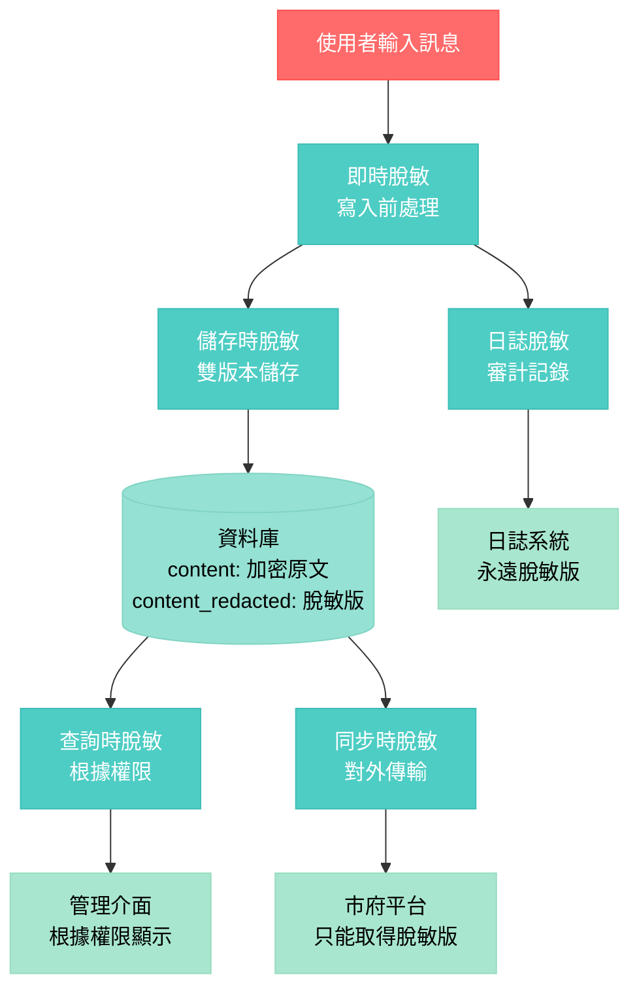
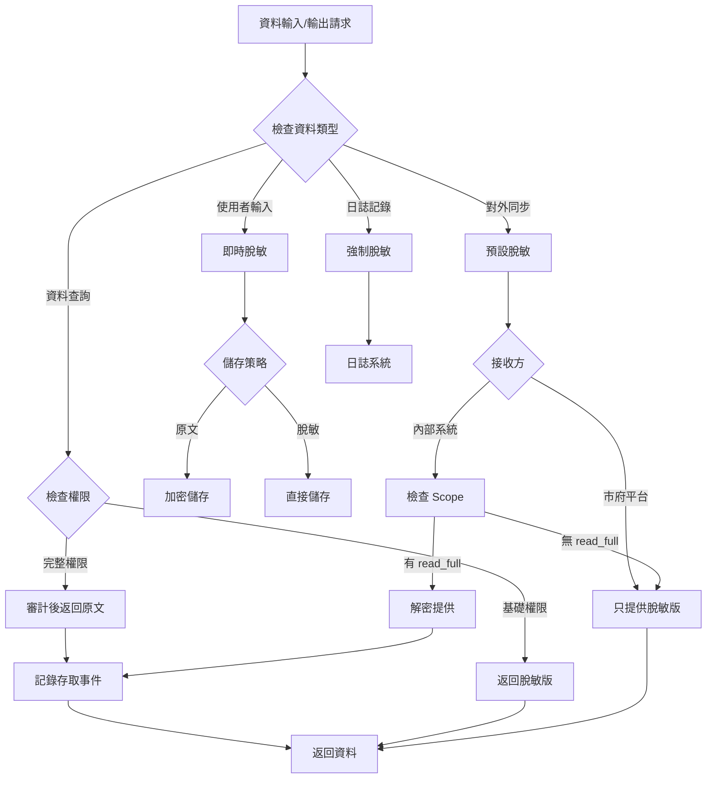

# 脫敏處理時機與流程 [暫緩實作]

## ⚠️ 注意：此功能暫緩實作
根據最新決定，脫敏機制暫時不實作。此文件保留作為未來參考。

## 脫敏處理時機總覽



## 1. 即時脫敏（寫入前）

### 觸發時機
```python
# 當使用者發送訊息時立即執行
@router.post("/chat")
async def chat(request: ChatRequest):
    # 1. 立即脫敏處理
    redacted_content = redactor.redact(
        request.message,
        mode="mask",
        lang=request.lang
    )
    
    # 2. 同時保存原文（加密）和脫敏版
    message = ConversationMessage(
        content=encrypt(request.message),  # 加密原文
        content_redacted=redacted_content.redacted,  # 脫敏版
        ...
    )
```

### 脫敏內容
- 身分證字號
- 電話號碼
- 地址
- Email
- 銀行帳號
- 健保卡號
- 姓名（保留姓氏）
- 醫療敏感詞
- 毒品相關詞彙

## 2. 儲存階段脫敏

### 資料庫儲存策略

```sql
-- conversation_messages 表結構
CREATE TABLE conversation_messages (
    id UUID PRIMARY KEY,
    conversation_id UUID NOT NULL,
    role TEXT NOT NULL,
    
    -- 三種版本的內容
    content TEXT NOT NULL,           -- 原文（應用層加密）
    content_encrypted BYTEA,         -- 加密後的原文（KMS加密）
    content_redacted TEXT,           -- 脫敏版本（永久儲存）
    
    -- 脫敏元資料
    redaction_metadata JSONB,       -- 記錄脫敏了什麼
    
    created_at TIMESTAMP NOT NULL DEFAULT now()
);
```

### 儲存流程

```python
async def save_message(self, message: str, user_id: str):
    # 1. 執行脫敏
    redaction_result = self.redactor.redact(message)
    
    # 2. 加密原文
    encrypted_data = await self.encryptor.encrypt(
        message,
        context={"user_id": user_id}
    )
    
    # 3. 儲存三個版本
    await self.db.save({
        "content": message,  # 僅開發環境，生產環境應為空
        "content_encrypted": encrypted_data["ciphertext"],
        "content_redacted": redaction_result.redacted,
        "redaction_metadata": {
            "items_found": len(redaction_result.found_items),
            "categories": list(set(item["category"] for item in redaction_result.found_items)),
            "timestamp": datetime.utcnow()
        }
    })
```

## 3. 查詢時脫敏（動態脫敏）

### 根據權限決定返回內容

```python
async def get_messages(
    conversation_id: str,
    client: dict = Depends(get_current_client)
):
    # 檢查客戶端權限
    has_full_access = "messages.read_full" in client["scopes"]
    
    messages = await db.get_messages(conversation_id)
    
    for message in messages:
        if has_full_access:
            # 有完整權限：解密並返回原文
            message["content"] = await decrypt(message["content_encrypted"])
            
            # 記錄審計事件
            await audit_logger.log(
                event_type="full_content_access",
                client_id=client["client_id"],
                resource=f"message:{message['id']}"
            )
        else:
            # 一般權限：只返回脫敏版
            message["content"] = message["content_redacted"]
            # 移除敏感欄位
            message.pop("content_encrypted", None)
    
    return messages
```

### 權限層級

| 權限等級 | Scope | 可見內容 | 審計要求 |
|---------|-------|---------|---------|
| 基礎 | messages.read | 只有 content_redacted | 一般記錄 |
| 完整 | messages.read_full | 可解密看原文 | 詳細審計+告警 |
| 統計 | messages.stats | 只有統計資料 | 一般記錄 |

## 4. 同步時脫敏（Pull API）

### 市府平台拉取資料時

```python
@router.get("/conversations/{conversation_id}/messages")
async def get_conversation_messages(
    conversation_id: UUID,
    include: Optional[str] = Query(None),
    client: dict = Depends(require_scopes("messages.read"))
):
    # 預設只返回脫敏版
    messages = await db.get_messages(conversation_id)
    
    response_items = []
    for msg in messages:
        item = {
            "id": msg.id,
            "role": msg.role,
            "content_redacted": msg.content_redacted,  # 永遠是脫敏版
            "risk": msg.risk_info
        }
        
        # 需要特殊權限才能取得原文
        if "content" in include.split(","):
            if "messages.read_full" not in client["scopes"]:
                raise HTTPException(403, "需要 messages.read_full 權限")
            
            # 解密並二次脫敏檢查
            original = await decrypt(msg.content_encrypted)
            
            # 即使有權限，仍做基礎脫敏
            item["content"] = self.light_redact(original)
            
            # 審計
            await audit_logger.log_sensitive_access(client, msg.id)
        
        response_items.append(item)
    
    return response_items
```

## 5. 日誌脫敏

### 所有日誌輸出都必須脫敏

```python
# logging_middleware.py
class RedactingLogger:
    def __init__(self):
        self.redactor = Redactor()
    
    async def log_request(self, request: Request, response: Response):
        # 脫敏請求內容
        body = await request.body()
        if body:
            redacted_body = self.redactor.redact(body.decode()).redacted
        else:
            redacted_body = ""
        
        # 脫敏回應內容
        redacted_response = self.redactor.redact(
            response.body.decode()
        ).redacted
        
        # 記錄脫敏後的日誌
        logger.info({
            "request": {
                "method": request.method,
                "path": request.url.path,
                "body": redacted_body,
                "ip": self.hash_ip(request.client.host)  # IP 也要處理
            },
            "response": {
                "status": response.status_code,
                "body": redacted_response[:500]  # 限制長度
            }
        })
    
    def hash_ip(self, ip: str) -> str:
        """IP 假名化"""
        return hashlib.sha256(f"{ip}:{DAILY_SALT}".encode()).hexdigest()[:8]
```

## 6. 風險事件脫敏

### 高風險事件的特殊處理

```python
async def handle_risk_event(assessment: RiskAssessment, message: str):
    if assessment.overall_level in [RiskLevel.HIGH, RiskLevel.IMMINENT]:
        # 1. 原文加密存檔（供專業人員評估）
        encrypted = await encrypt(message)
        
        # 2. 通知使用最小必要資訊
        notification = {
            "user_id": hash_user_id(user_id),  # 假名化
            "risk_level": assessment.overall_level,
            "categories": assessment.categories,
            "evidence": [
                self.minimize_evidence(e) for e in assessment.evidence
            ],
            # 不包含原文，只有風險指標
        }
        
        # 3. 專業人員需要時才解密
        if crisis_team_needs_details:
            # 需要多重認證
            if await verify_crisis_team_auth():
                decrypted = await decrypt_with_audit(encrypted)
                # 仍然做基礎脫敏
                return self.crisis_redact(decrypted)
```

## 7. 匯出資料脫敏

### 資料匯出或分析時

```python
async def export_data_for_analysis(date_range, purpose: str):
    # 根據用途決定脫敏程度
    redaction_levels = {
        "statistics": "full",      # 完全脫敏
        "research": "partial",     # 部分脫敏
        "audit": "minimal",        # 最小脫敏（需特殊權限）
        "legal": "none"           # 不脫敏（需法務授權）
    }
    
    level = redaction_levels.get(purpose, "full")
    
    data = await db.get_conversations(date_range)
    
    if level == "full":
        # 完全脫敏：移除所有 PII
        return fully_redact(data)
    elif level == "partial":
        # 保留統計價值但移除身份資訊
        return partially_redact(data)
    elif level == "minimal":
        # 只遮蔽最敏感資訊
        return minimally_redact(data)
    elif level == "none" and has_legal_authorization():
        # 完整資料（需解密）
        return decrypt_all(data)
```

## 脫敏決策流程圖



## 脫敏層級定義

### Level 1: 完全脫敏（預設）
- 移除所有 PII
- 適用：日誌、公開統計

### Level 2: 部分脫敏
- 保留部分資訊（如姓氏）
- 適用：內部分析

### Level 3: 最小脫敏
- 只遮蔽最敏感資訊
- 適用：專業評估

### Level 4: 加密原文
- 完整保留但加密
- 適用：法務需求

## 關鍵原則

1. **預設脫敏** - 除非明確需要，否則一律脫敏
2. **最小權限** - 只給必要的資料存取權
3. **審計追蹤** - 所有原文存取都要記錄
4. **不可逆性** - 脫敏操作不可還原（除非有原文）
5. **分層防護** - 多層脫敏確保安全